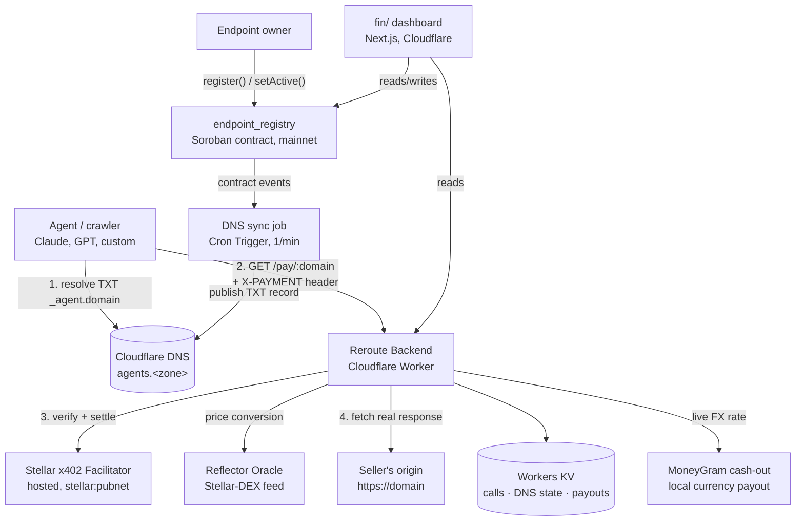

<div align="center">


# Reroute

### The first DNS record that prices AI agent traffic — and pays the site back for carrying it.

*AI agents scrape, crawl, and call websites at a scale human traffic never did. The ad revenue that used to fund that traffic didn't come with it. Reroute prices every agent request at the DNS layer and settles payment on-chain, in seconds, before the agent ever reaches the server.*

[](https://stellar.org)
[](https://developers.stellar.org/docs/build/agentic-payments/x402)
[](https://workers.cloudflare.com/)
[](https://nextjs.org)
[](https://www.typescriptlang.org/)
[](#license)

</div>

---

## What is Reroute?

Every site that publishes content or exposes an API now has a second audience it never billed: agents. They read your docs, scrape your pages, call your endpoints — real bandwidth, real compute, real origin load — and none of it shows up as an ad impression or a subscription. The traffic that used to be a cost you could offset is now a cost you just absorb.

Reroute turns that cost back into revenue. Register a domain once, and Reroute publishes an [AID](https://aid.agentcommunity.org/)-style `_agent.<domain>` TXT record carrying your price, currency, settlement asset, and payout address. Any agent — Claude, GPT, a custom crawler — resolves the exact terms of accessing your content in a single DNS lookup, before it ever sends a request:

```
v=aid1;uri=<endpoint>;proto=mcp;p=stellar-x402;
price=<amount>;cur=<currency>;asset=<contract>;payto=<address>;
facilitator=<url>;active=true
```

If the agent decides to proceed, it pays through the standard [x402](https://developers.stellar.org/docs/build/agentic-payments/x402) protocol on Stellar — an on-chain, per-request micropayment that settles in seconds. No API keys to issue, no invoices to chase, no chargebacks. The moment payment clears, Reroute's proxy fetches your real site and returns your real response — the agent never touches your origin unpaid.

The effect: a site under heavy agent load doesn't have to choose between blocking crawlers outright (losing visibility to the agents that increasingly *are* your traffic) and eating the cost silently (losing margin). Every agent request becomes a few cents of settled revenue instead of a line item on a server bill — and that revenue can be cashed out directly into the currency the creator actually spends, through MoneyGram.

> **Why DNS, not just a 402 response?** x402 already answers "how do I pay" — that part isn't new. What's missing is "how do I know the price without asking first." An agent that has to make a live request just to read a 402 wastes a round trip on every cold call, and has no way to compare five candidate providers by price without hitting each one's server. Putting price, currency, asset, and payee in DNS collapses discovery into the same lookup an agent already performs to resolve the domain — zero requests sent to your origin until money has actually moved.

---

## Features

### For sites & API providers
- **Price any route from one DNS record** — set it once from the dashboard; agents everywhere resolve it without hitting your server.
- **Get paid automatically, per request** — no signup flow, no API key issuance, no billing integration. A cleared x402 payment *is* the access grant.
- **Cash out into local currency via MoneyGram** — pick a payout country and the USDC your endpoint has collected converts to local currency at the live exchange rate, with a reference code and payout history.
- **Rate limits and payer policy, enforced on-chain** — allow/deny lists and per-payer request limits are checked *before* settlement is attempted, not after.
- **A live dashboard** — endpoints, DNS setup with real-time verification, a verified access log (payer, country, agent, tx hash), analytics (revenue, calls by country/agent, payouts by country), and cash-out, all polling live data.

### For agents
- **Resolve without a request** — the `resolve_endpoint` MCP tool reads price, currency, asset, and payee straight from DNS. Zero HTTP calls to the seller or to Reroute's own backend.
- **Pay and call in one step** — `pay_endpoint` resolves the live price, pays via x402, and returns the seller's real response, with an optional `maxAmount` guard against price changes since you last checked.
- **Look up any domain, live** — a public DNS search on the website resolves any Reroute-priced domain in real time, whether or not it's in Reroute's own directory.

### The protocol
- **AID-style TXT record** — `v=aid1;uri=...;price=...;cur=...;asset=...;payto=...;facilitator=...;active=...`, resolved via standard DNS-over-HTTPS, following CNAMEs like any resolver would.
- **On-chain source of truth** — a Soroban registry contract (`endpoint_registry`) holds pricing and ownership; the DNS record is a cache of what's on chain, kept in sync by a Cron-triggered job watching contract events.
- **Standard x402 settlement** — verification and settlement run through Stellar's hosted x402 facilitator. Reroute never custodies funds or runs its own facilitator.

---

## Architecture



| Piece | Role |
|---|---|
| `endpoint_registry` (Soroban) | On-chain source of truth for price, accepted assets, payout address, payer policy — see [Mainnet Deployment](#mainnet-deployment). |
| Reflector oracle | Address-based Stellar-DEX price feed the registry calls to convert an endpoint's reference price into its accepted assets. |
| DNS sync job | Watches registry events, publishes the `_agent.<domain>` TXT record via Cloudflare — the DNS record is a cache of on-chain state, never the source of truth. |
| `/pay/:domain` proxy | The x402 payment gate — verifies, settles against the facilitator, then fetches and returns the seller's real origin. |
| MoneyGram cash-out | Converts an endpoint's collected USDC into the owner's local currency at a live rate, on demand. |
| `mcp-server/` | Gives Claude (or any MCP client) real tools to resolve and pay Reroute endpoints from a conversation. |
| `fin/` dashboard | Registration, DNS setup, live call log, analytics, payouts, and a public no-wallet Browse + resolve page. |

---

## Mainnet Deployment

Reroute's contracts and payment path moved to Stellar mainnet on **2026-08-24**.

| Component | Value |
|---|---|
| `endpoint_registry` contract | `CALTXNYPEFU24UUSYJMHZCTE44ASRNXZ3FOHTIEDKWVQJSZFVZKMVG5D` |
| Admin / deployer | `GD4YDGESVMWKAXYO3SXWE7H45SHHZC66DE33KBJXI5VY6Q27NKVOTTNQ` — scoped to `admin_deactivate` only; there is no rotation function, so this address is permanent. |
| Reflector oracle | `CALI2BYU2JE6WVRUFYTS6MSBNEHGJ35P4AVCZYF3B6QOE3QKOB2PLE6M` |
| x402 network id | `stellar:pubnet` |
| x402 facilitator | `https://channels.openzeppelin.com/x402` |
| USDC (SAC) | `CCW67TSZV3SSS2HXMBQ5JFGCKJNXKZM7UQUWUZPUTHXSTZLEO7SJMI75` |
| XLM (SAC) | `CAS3J7GYLGXMF6TDJBBYYSE3HQ6BBSMLNUQ34T6TZMYMW2EVH34XOWMA` |

**Status:** infrastructure is live — the registry, oracle wiring, and facilitator are deployed and reachable on mainnet. No payment has settled there yet, so end-to-end settlement is verified on testnet only (below); treat mainnet as deployed, not yet exercised.

---

## How it works

1. **Register.** An owner calls `endpoint_registry::register` with a domain, a reference currency + price, optional accepted assets, and a facilitator URL. Pricing and payout address live on chain, not in a database.
2. **Discover.** The DNS sync job watches the registry's events and publishes an AID-style `_agent.<domain>` TXT record through a CNAME the owner adds once — carrying everything needed to construct a payment, resolved in one DNS lookup.
3. **Pay.** An agent hits the paid route, gets a standard x402 `402` built from the registry's live on-chain state, pays, and retries with an `X-PAYMENT` header. A human can do the same from the dashboard's Browse page with a connected wallet — no code required.
4. **Serve.** Once payment settles, the proxy fetches the owner's real site and returns its real response. The call is logged live to the dashboard, tagged with payer, country, and the calling agent's user agent.
5. **Cash out.** The owner picks a MoneyGram payout country from the dashboard; collected USDC converts to local currency at the live exchange rate and settles with a reference code, on demand.

---

## The Dashboard

| Tab | What it does |
|---|---|
| **Endpoints** | Register a domain, set price/currency/accepted assets, pause/resume access. |
| **DNS Setup** | The exact CNAME to add, with live verification polling — no manual "check now" step. |
| **Calls** | The verified access log: payer, amount, country, calling agent, timestamp, and a link to the settled transaction. |
| **Analytics** | Revenue and call volume per domain, calls by country and by agent, and payouts by off-ramp country. |
| **Payouts** | Pick a MoneyGram payout country, see collected USDC converted to local currency at the live rate, cash out, and review payout history. |
| **Browse** | Public, no-wallet page listing every active endpoint straight from DNS — plus a live search box to resolve *any* domain's price on demand. |

---

## For agents

The DNS record's `proto=mcp` field is backed by a real tool, not just a claim: `mcp-server/` plugs into Claude Code or Claude Desktop, hand it a Stellar key, and a normal conversation — *"check the price on demoea.neurus.xyz and pay if it's under $1"* — resolves via DNS, pays via x402, and calls the real endpoint, without anyone writing a script. See `mcp-server/README.md` for setup.

---

## Verified end-to-end (Stellar testnet)

- On-chain registration and the resulting `402` response carry the exact price/asset/payTo the registry contract holds, confirmed by driving a real request through the deployed contract.
- A real signed payment from a funded testnet wallet, verified and settled through Stellar's hosted facilitator, in real Circle testnet USDC — confirmed independently against Horizon.
- Non-USDC settlement, end to end: a live endpoint priced in XLM was paid, verified, and settled through the same facilitator with no integration changes — the facilitator is asset-parameterized, not USDC-hardcoded.
- The proxy fetching a real origin after settlement and returning its actual response, not a stand-in.
- Per-payer rate limiting and an on-chain allow/deny `PayerPolicy`, both enforced *before* settlement — a blocked or rate-limited payer's transaction never reaches the chain.
- The backend runs as a deployed Cloudflare Worker (`reroute-backend`, reachable at `api.neurus.xyz`) with state in Workers KV and DNS sync on a real Cron Trigger — not a local process kept alive for a demo.

**Still open:** the registry's `accepted_assets` field exists on chain but isn't read by the 402 quote yet — every endpoint currently prices in its single `reference_asset` only. See `ROADMAP.md`.

---

## License

Released under the **MIT License**.

<div align="center">
<sub>Built on <a href="https://stellar.org">Stellar</a> · <a href="https://developers.stellar.org/docs/build/agentic-payments/x402">x402</a> · <a href="https://workers.cloudflare.com/">Cloudflare Workers</a></sub>
</div>
